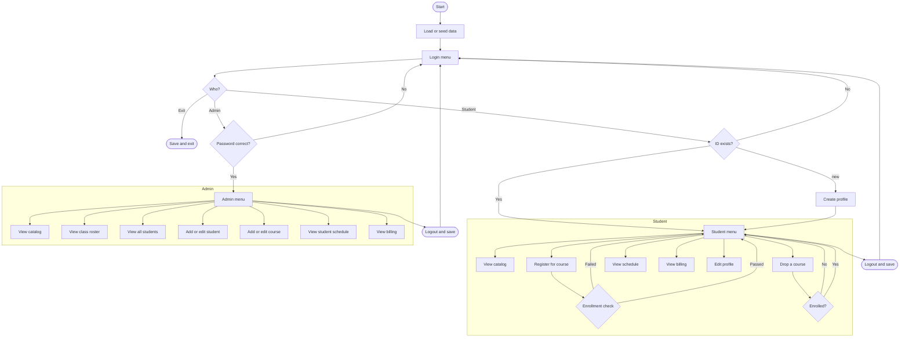

# unknownapp
This is an unknown application written in Java

---- For Submission (you must fill in the information below) ----
### Use Case Diagram

### Flowchart of the main workflow

### Prompts
"Write a Python version of View My Schedule for students to See all currently enrolled courses + total credits"
